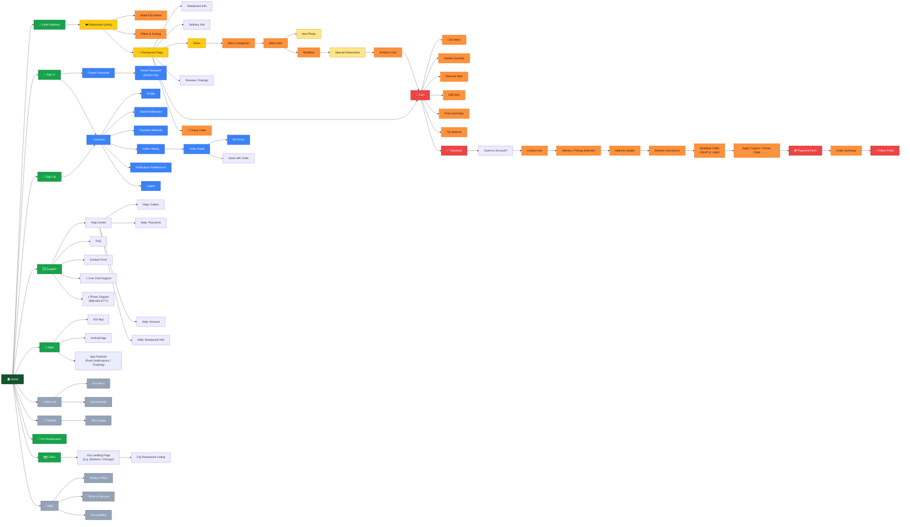

# Site Map & Product Analysis — EatStreet Project

## Product essence
EatStreet is an American online food ordering marketplace connecting diners with local restaurants for delivery and takeout Currently, EatStreet claims partnerships with approximately 7,000 restaurants across 250+ U.S. cities, with delivery fulfilled via contracted third-party providers (e.g., UberEats, DoorDash drivers) since August 2023.
Key value propositions:

For diners: Simple, centralized ordering from local restaurants with real-time tracking, group ordering, and exclusive deals.
For restaurants: A marketplace listing + tools for custom websites, branded menu pages, POS integration, digital marketing, and loyalty programs — with no upfront cost, commission-based pricing.

---
## Subsystems (observable)

From a study QA team perspective, EatStreet should be analyzed as a **black-box, user-facing e-commerce and food delivery platform**, with testing efforts focused on observable user interactions and end-to-end flows.

The primary QA focus areas include:

- **Location-based discovery** — address input, validation, and restaurant availability;
- **Restaurant listing and filtering** — search results, sorting, and availability states;
- **Menu browsing and item configuration** — categories, item details, and modifiers;
- **Cart behavior** — item management, quantity updates, and price recalculation;
- **Checkout flow and validation** — required fields, delivery options, and order summary;
- **Authentication and account flows** — sign in, sign up, and user data management;
- **Support and recovery flows** — help center, contact forms, and post-order assistance.

All testing should be based strictly on **visible system behavior**, without assumptions about backend logic or internal system architecture.

---

## Navigation Caveats

- Restaurant availability depends on the user’s address.
- Without a valid address, the main ordering flow may be blocked.
- Some restaurants may be closed, unavailable, or outside the delivery area.
- Checkout may require valid contact information, address, and payment details.
- Some flows may behave differently for guest and registered users.
- Pricing may change based on quantity, modifiers, delivery fees, taxes, or service fees.
- Restaurant Dashboard and internal merchant tools are not publicly testable.
- Real payment and order fulfillment should not be tested in a study project.

---

# Site Map

